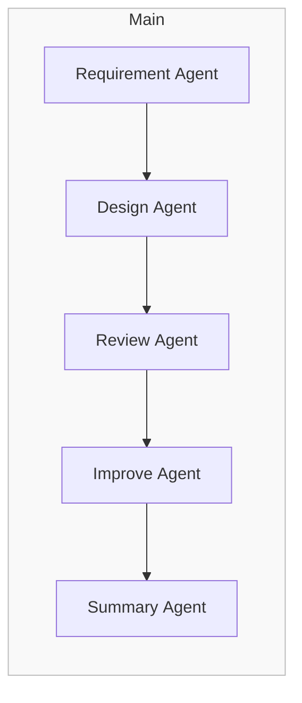

# UI Design Multi‑Agent PoC

## 1. Overview

This repository hosts a **proof‑of‑concept multi‑agent system** that automates the process of generating, reviewing, and improving UI code *without a dedicated human designer*.

Given (a) a minimal set of user requirements and (b) an existing front‑end codebase, the system will:

1. Collect & save existing code as Artifacts.
2. Generate a first‑pass UI that respects existing design patterns.
3. Review that UI against standard usability heuristics (WCAG / Nielsen 10).
4. Apply improvements and return refined code plus a concise report.

> **Inspired by**: Google Agent Development Kit samples, commit `0360dd1` (Apache‑2.0).\
> Portions of their architecture informed this PoC.

---

## 2. High‑Level Workflow



All intermediate artefacts (code, JSON, screenshots) are written to the ADK Artifact store and referenced by metadata so that agents remain loosely coupled.

---

## 3. Agent Architecture

| Agent                  | Role                                                                      | Key Tools / APIs                                                                     |
| ---------------------- | ------------------------------------------------------------------------- | ------------------------------------------------------------------------------------ |
| **root\_agent**        | Orchestrates execution order, reads Artifact metadata to decide next step | ADK Session State                                                                    |
| **requirement\_agent** | Chats with user, saves existing code (`save_existing_code_tool`)          | Artifact API                                                                         |
| **design\_agent**      | Generates initial UI code using design knowledge + saved code             | `fetch_design_info_tool`   • `fetch_design_knowledge` (fixed URLs)  • `use_artifact` |
| **review\_agent**      | Evaluates code against WCAG & Nielsen heuristics, outputs issue JSON      | Vision‑less LLM                                                                      |
| **improve\_agent**     | Applies fixes based on review JSON, writes updated code                   | Artifact API                                                                         |
| **summary\_agent**     | Collates final code & report for the user                                 | Markdown formatter                                                                   |

---

## 4. Directory Structure

```text
.
├── agents/
│   ├── root_agent.py
│   ├── requirement_agent.py
│   ├── design_agent.py
│   ├── review_agent.py
│   ├── improve_agent.py
│   └── summary_agent.py
├── shared_libraries/
│   ├── fetch_design_knowledge.py
│   └── use_artifact.py
├── artifacts/            # Auto‑generated (git‑ignored)
├── LICENSE               # Apache 2.0
├── NOTICE                # Required notice file
└── README.md
```

---

## 5. Quick Start (Local)

```bash
# 1 Install dependencies
poetry install

# 2 Run the agent flow
poetry run adk run .
```

The first execution will prompt the **requirement\_agent** for minimal project info and automatically archive your existing front‑end code into the Artifact store.

---

## 6. Scope & Future Work

| Implemented in PoC                                  | Deferred / Future                                    |
| --------------------------------------------------- | ---------------------------------------------------- |
| Local execution only (no CI/PR)                     | GitHub Actions integration for auto‑review           |
| Code‑only analysis (no screenshots)                 | Vision model support & diff images                   |
| Single iteration (`design → review → improve` once) | Multi‑loop with quality target & cost control        |
| Fixed Material Design knowledge source              | Pluggable guideline fetcher (e.g. Carbon, Fluent UI) |

---

## 7. License & Notices

This project is licensed under the **Apache License 2.0**. See the [`LICENSE`](./LICENSE) file for details.

Portions of this project are adapted from **Google ADK Samples** (commit `0360dd18db213ccda9451d6f235a65d63fb0f587`) which are also licensed under Apache 2.0. A copy of the original notice is provided in the [`NOTICE`](./NOTICE) file.

---

*Happy prototyping!*

